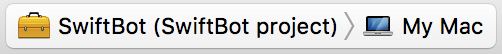
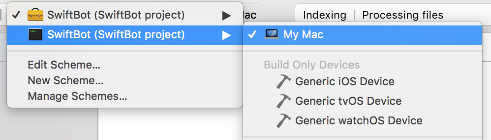
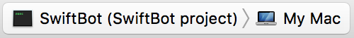

# Sword - A Discord Library for Swift

[](https://swift.org) [](https://travis-ci.org/Azoy/Sword) [](https://github.com/Azoy/Sword/releases)

## Requirements
1. macOS, Linux, iOS, watchOS, tvOS (no voice for iOS, watchOS, or tvOS)
2. Swift 4.0
3. libsodium (if on macOS or Linux)

## Installing libsodium
### macOS
Installing libsodium is really easy on mac as long as you have [hombrew](https://brew.sh). After that is installed, all you have to do is `brew update && brew install libsodium`. That's it!

### Linux
This depends on the version of Ubuntu you are running, so I made a nice table here:

| Ubuntu 14.04 | Ubuntu 16.04 |
|:-----------------------------------------------------------------------------------------------------------------------:|:-----------------------------------------------------------:|
| `sudo -E add-apt-repository -y ppa:chris-lea/libsodium && sudo apt-get update && sudo apt-get install -y libsodium-dev` | `sudo apt-get update && sudo apt-get install -y libsodium-dev` |

It's easier to copy and paste that command right into shell, and follow any on screen instructions if needed so.

## Adding Sword
### Swift Package Manager
In order to add Sword as a dependency, you must first create a Swift executable in a designated folder, like so `swift package init --type executable`. Then in the newly created Package.swift, open it and add Sword as a dependency

```swift
// swift-tools-version: 4.0

import PackageDescription

let package = Package(
    name: "yourswiftexecutablehere",
    dependencies: [
        .package(url: "https://github.com/Azoy/Sword", from: "0.9.0")
    ],
    targets: [
      .target(
        name: "yourswiftexecutablehere",
        dependencies: ["Sword"]
      )
    ]
)
```

After that, open Sources/main.swift and remove everything and replace it with the example below.

```swift
import Sword

let bot = Sword(token: "Your bot token here")

bot.editStatus(to: "online", playing: "with Sword!")

bot.on(.messageCreate) { data in
  let msg = data as! Message

  if msg.content == "!ping" {
    msg.reply(with: "Pong!")
  }
}

bot.connect()
```

### CocoaPods
Adding Sword to your iOS, watchOS, or tvOS application is easier than ever with CocoaPods. All you have to do is add Sword as a dependency to your Podfile, something like this:

```ruby
target 'yourappnamehere' do
  use_frameworks!
  pod 'Sword'
end
```

Then all you have to do is `pod install` and you're ready to go.

## Running the bot (SPM)
Build the libraries with `swift build`, then type `swift run`

## Running the bot in Xcode (SPM)
To run the bot in Xcode, you first have to compile the libraries with `swift build`. Then to build the xcode project, type `swift package generate-xcodeproj`. Finally, type `open yourswiftexecutablehere.xcodeproj`, look at the top and follow the steps below







Then click the play button!

## Links
[Documentation](http://sword.azoy.me) - (created with [Jazzy](https://github.com/Realm/Jazzy))

Join the [API Channel](https://discord.gg/99a3xNk) to ask questions!
